# INSTALLATION
  1. Download Android Studio
  2. Download This repo
  3. Select project folder as that repo
  
This app uses 'firebase' as a backend server. for whom want to customize project, change the config files whith your appropriate file.

  Have fun.

## Screenshots of application

. | . | .
------------ | ------------- | -------------
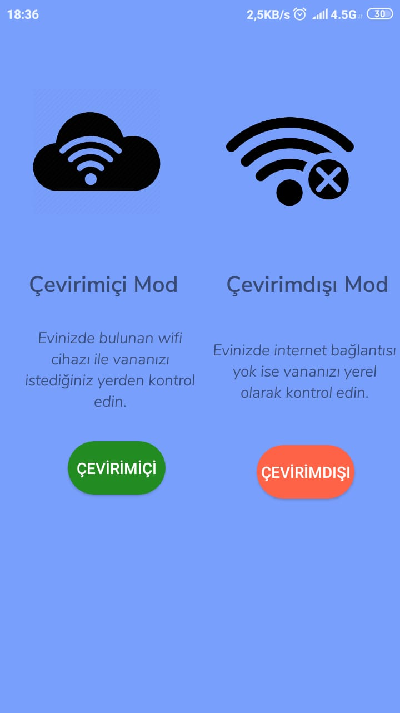 | 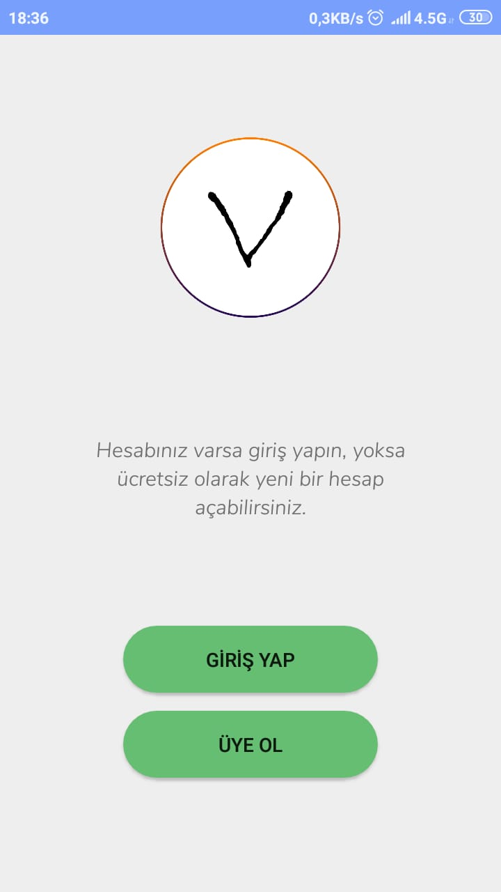 | 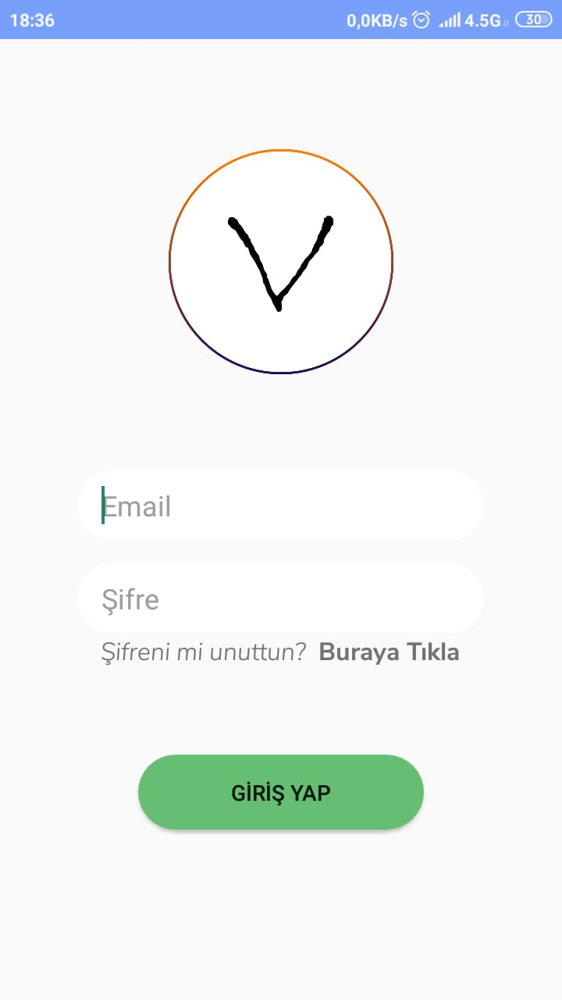
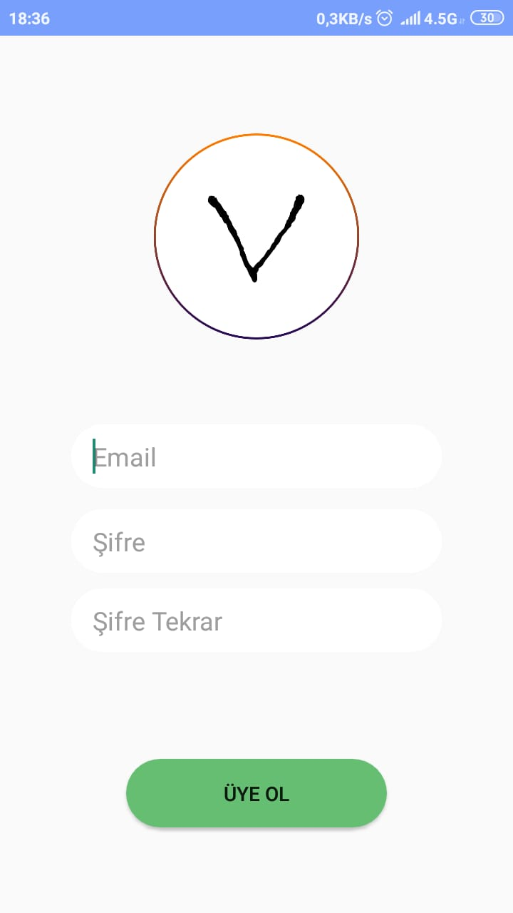 | 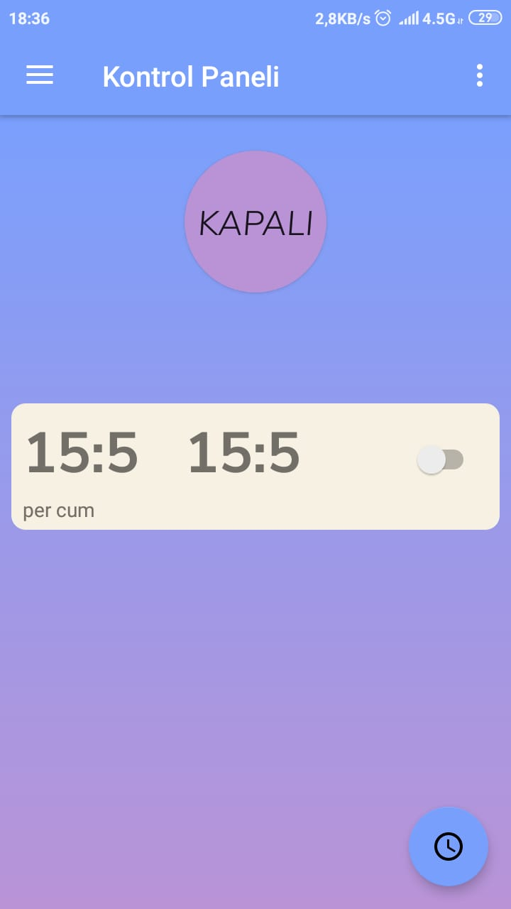 | 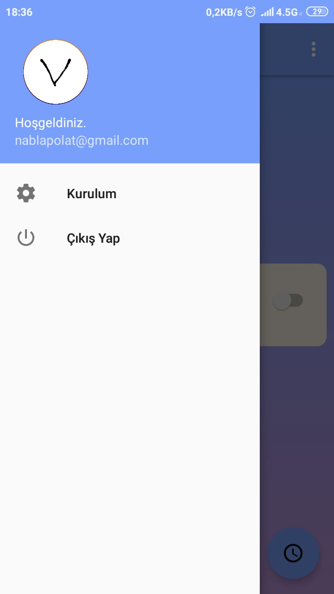
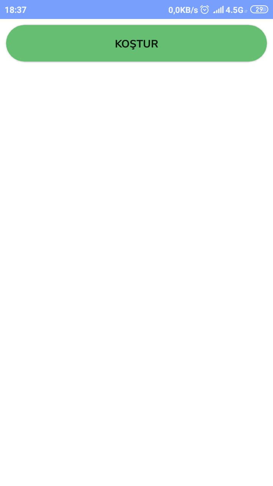 | 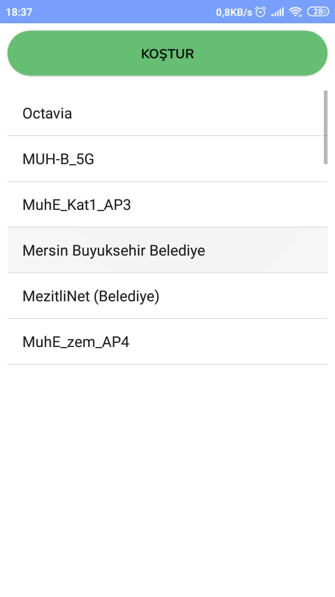 | 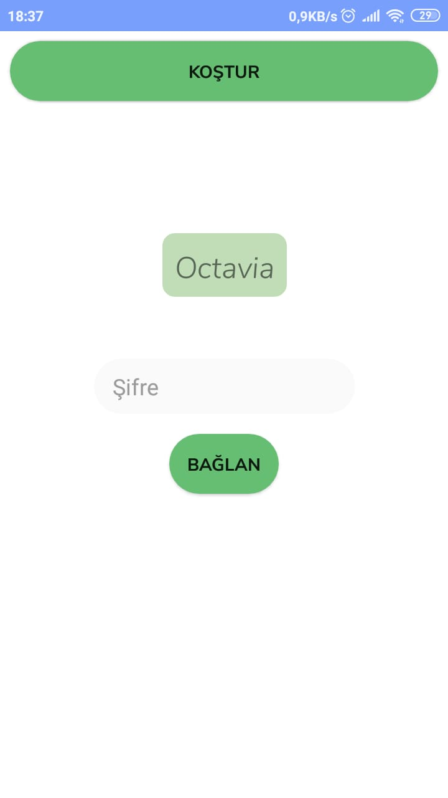
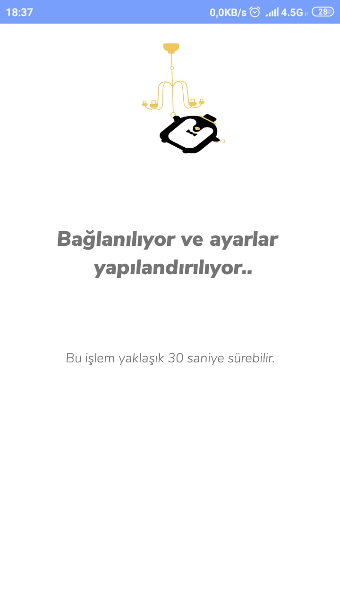 | 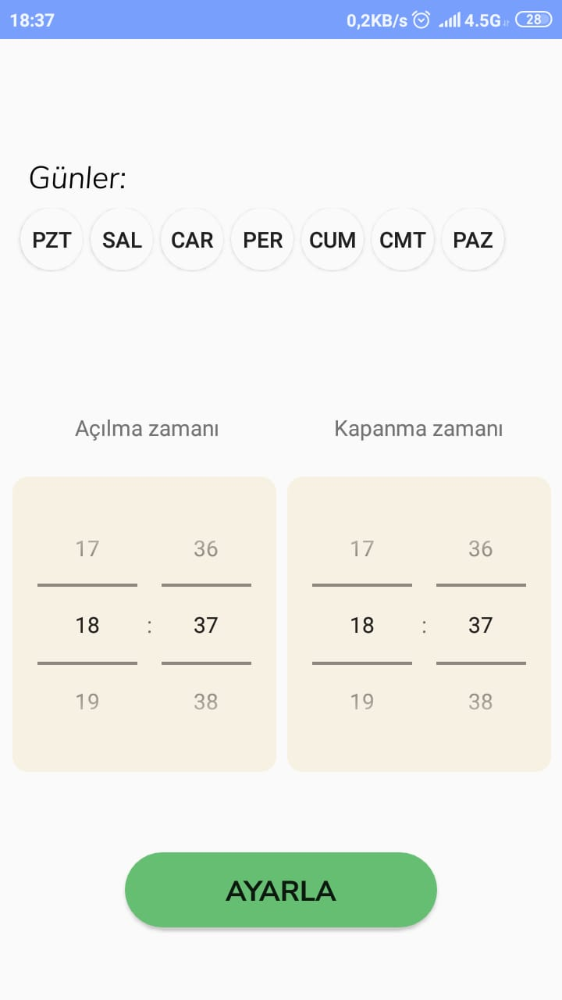
